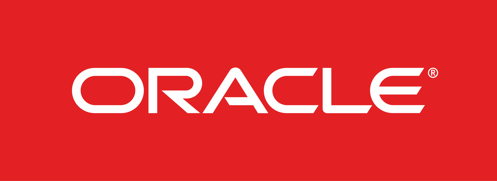
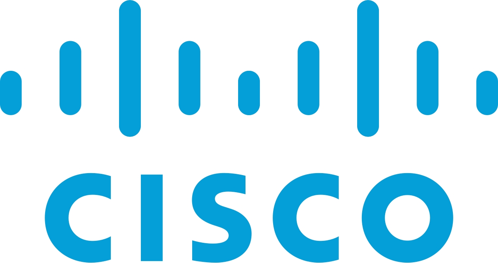

  

 

---

## 👨‍💻 About Me

- 🔴 **SDE II @ Oracle** working on large-scale distributed systems and backend infrastructure
- 🔵 **Previously @ Cisco AppDynamics (Splunk)** working on observability and monitoring platforms
- 🏗️ **Building** [Engineering Atlas](https://learn.engineering-atlas.workers.dev) — a deep-dive learning hub for backend engineers
- 📱 **Content Creator** [@abhishek.tech._](https://www.instagram.com/abhishek.tech._/) covering Java, System Design, and Distributed Systems
- 📍 Bengaluru, India
- 💬 Ask me about **Java Concurrency · Distributed Systems · System Design · Backend Engineering**
- 📅 **Book a 1:1** for resume building or job switch guidance at [topmate.io/abhishek_goyal17](https://topmate.io/abhishek_goyal17/)

---

## 💼 Experience

<table>
<tr>
<td width="50%" valign="top">

###  Oracle - SDE II
`Dec 2024 – Present`

Working on the **Oracle AHF team**, building backend systems for distributed cluster diagnostics, automated health monitoring, and intelligent resource management across large-scale Oracle RAC and DataGuard environments.

Core focus areas: multithreaded Java systems, distributed coordination, scheduling infrastructure, and AI-assisted diagnostics tooling.

`Java` `Multithreading` `Distributed Systems` `Python` `Linux`

</td>
<td width="50%" valign="top">

###  Cisco AppDynamics (Splunk) - SDE I
`Jul 2023 – Nov 2024`

Worked on the **Browser Real User Monitoring (BRUM)** platform, building microservices for traffic simulation, session sampling at scale, and distributed data ingestion. Contributed to cloud migration initiatives.

Core focus areas: Spring Boot microservices, Redis-based distributed state, container orchestration on AWS.

`Java` `Spring Boot` `Redis` `Docker` `Kubernetes` `AWS`

---

###  Red Hat - SWE Intern
`Jan 2023 – Jun 2023`

Built automation tooling for build pipeline configuration management using GitHub APIs and Go.

`Go` `GitHub APIs` `YAML`

</td>
</tr>
</table>

---

## 🛠️ Tech Stack

**Languages**

**Backend & Infrastructure**

**Databases**

**Observability**

---

## 📖 Engineering Atlas

> Building a free learning hub for backend engineers in India and beyond. No paywalls. Just depth.
>
> **[learn.engineering-atlas.workers.dev](https://learn.engineering-atlas.workers.dev)**

| Topic | Coverage |
|-------|----------|
| ☕ **Java Internals** | JVM, Java Memory Model, Multithreading, Virtual Threads, Lock-Free Programming |
| 🏗️ **System Design** | 98-concept reference, ML System Design, Trading Systems, Live Streaming |
| ⚡ **Distributed Systems** | 2PC vs Saga, Idempotency, Rate Limiting, Concurrency Control |
| 🤖 **ML Infrastructure** | RAG Pipelines, LLM Serving, KV Cache, Continuous Batching, Feature Stores |

---

---

## 📊 GitHub Stats

| Total Contributions | Longest Streak | Current Streak |
|:---:|:---:|:---:|
| **210+** | **4 days** | **1 day** |

---

## 📅 Book a 1:1 with Me

### Got a goal? Let's work on it together.

| What | Who it's for |
|------|-------------|
| 📄 **Resume Building** | Engineers wanting an impactful resume that actually gets shortlisted |
| 🔄 **Job Switch Strategy** | Devs planning their next move to a product company or FAANG |
| 🏗️ **System Design Prep** | Interview prep for backend and distributed systems rounds |
| ☕ **General Mentorship** | Career questions, tech stack choices, growth strategy |

---

---

